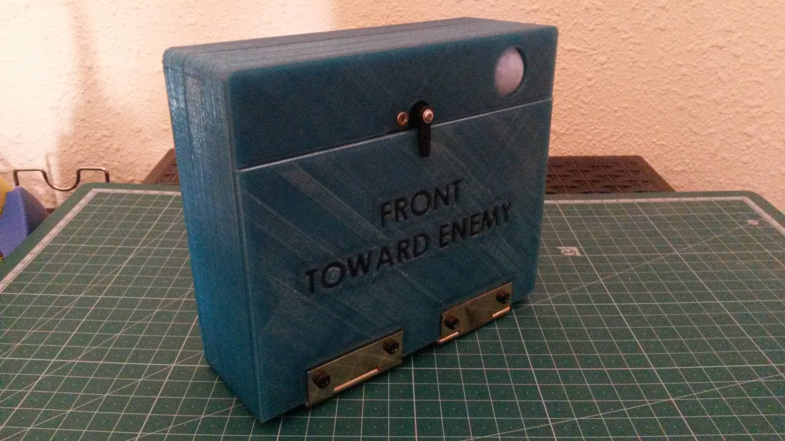
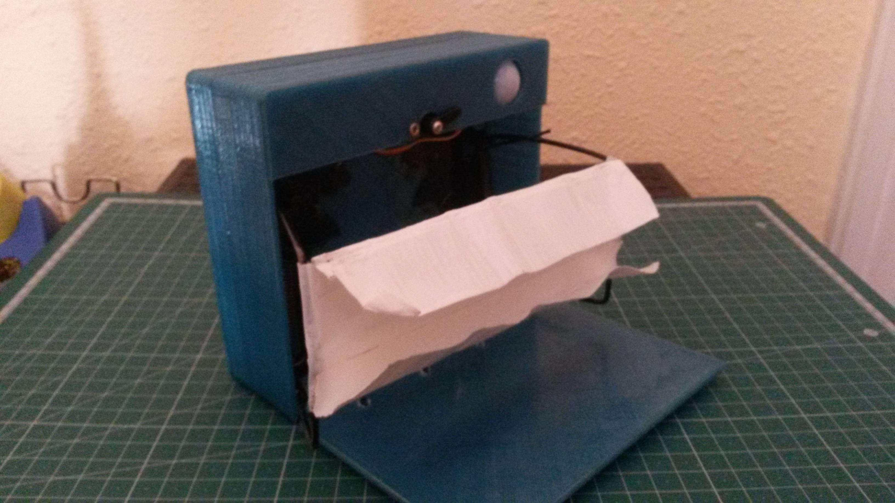
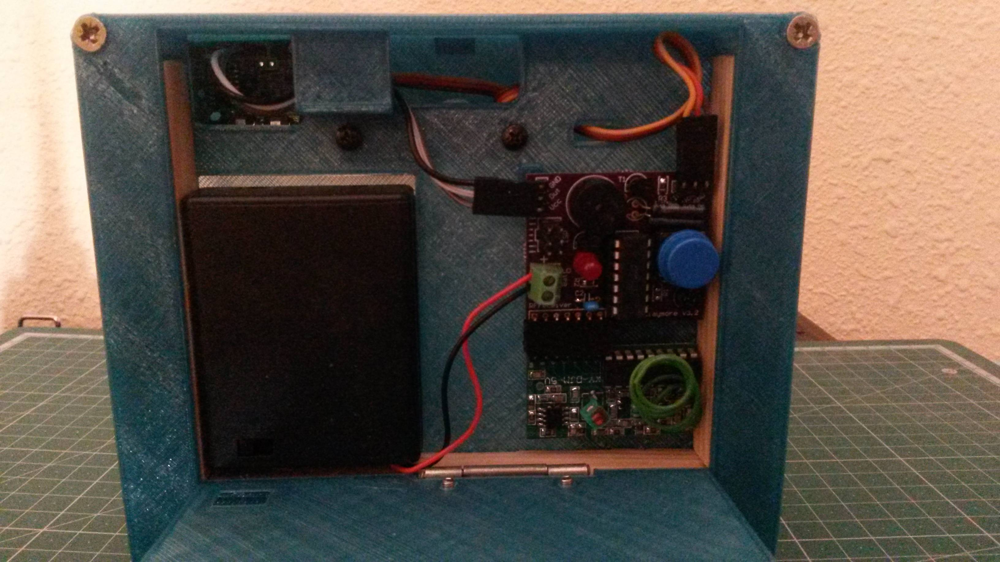
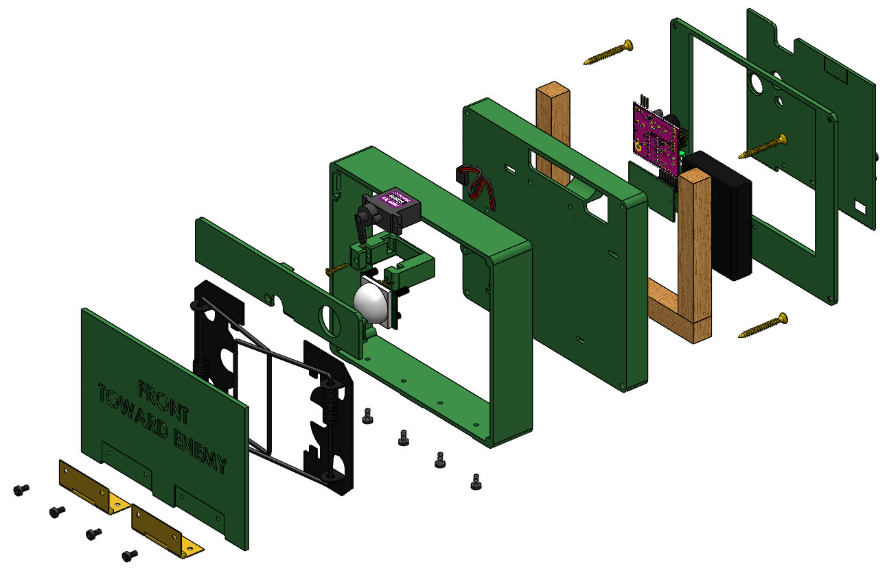

# DIY Airsoft claymore

## About

This is a remote controlled, motion sensing, BB throwing airsoft Claymore that I developed, built and used on my own matches.
I'm releasing its design on the hope that other makers can enjoy it.

More info and some videos @ https://airsoftdiy.com/3d-printed-airsoft-claymore/

## Features (for users)
- A doble mousetrap mechanism that shoots BBs forward.
- A motion sensor that triggers when an enemy (or a friend, or you) walks in front.
- Flashing Led and loud piezo in the victim doesn't realize what hit him.
- A button on the backside to open/close (short press) or activate/deactivate the motion sensor (long press).
- A remote controller with these functions (note the bold initials, which correspond to the remote buttons):
	- **A**ctivate the motion sensor.
	- **B**OOM -> Immediately opens and shoots the BBs.
	- **C**heck range -> Flash Led. Useful if you hide far and aren't sure if the signal will reach. If it's too sunny to see the Led, a long press will also trigger a sound. 
	- **D**eactivate the motion sensor.
- Works on 4xAAA batteries. Very long battery life. While it's not opening or closing, it sleeps and only consumes a few microamperes (even while motion sensor is active).

## Features (for makers)
- Easy to print body. All parts have a flat surface and need no supports.
- Most of the structural integrity comes from 3 internal wood bars. Otherwise it would literally self-destruct due to the force of the rat trap springs.
- Easy to solder PCB. Most components are big and through-hole, with a couple SMD resistors but they're still relatively big.

## Instructions
**At the moment there is no step-by-step tutorial**. If you wish to build your own Claymore, you need to be familiar with:

- 3D printing stl files
- Manufacturing a PCB from gerbers (as in, sending it to a fabhouse)
- Sourcing and soldering electronic components (most are very basic, but ask for help if needed)
- Loading an Arduino program into an ATtiny84 (I recommend using an SPI programmer, since I put a connector on the board)
	
If you want to modify the enclosure and the PCB, you’ll also need to use Solidworks and Altium, respectively.
The firmware is developed in C++ on the Arduino IDE.

## License
Licenced under GPLv3+. Contact the author if you wish to use it under any other license.

    This program is free software: you can redistribute it and/or modify
    it under the terms of the GNU General Public License as published by
    the Free Software Foundation, either version 3 of the License, or
    (at your option) any later version.

    This program is distributed in the hope that it will be useful,
    but WITHOUT ANY WARRANTY; without even the implied warranty of
    MERCHANTABILITY or FITNESS FOR A PARTICULAR PURPOSE.  See the
    GNU General Public License for more details.

    You should have received a copy of the GNU General Public License
    along with this program.  If not, see <http://www.gnu.org/licenses/>.
	